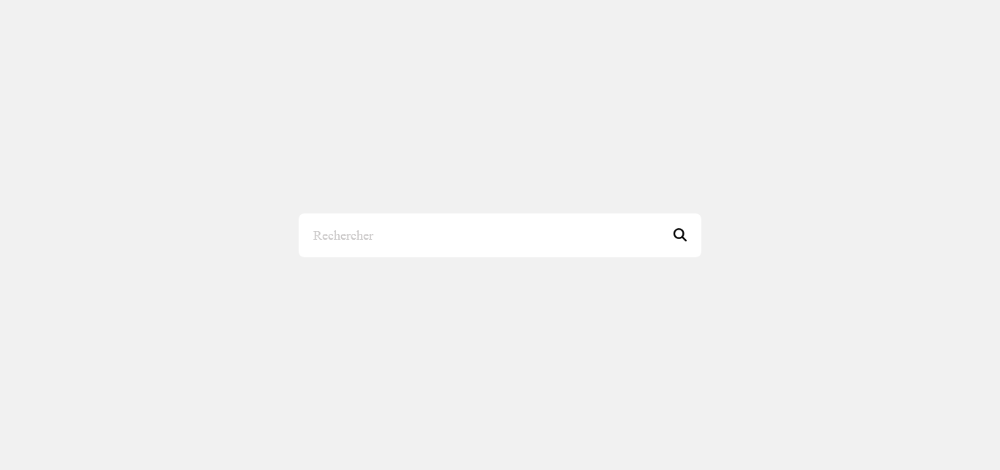

## BARRE DE RECHERCHE AVEC APPARITION DE SUGGESTIONS 🔍️

## Le challenge

Ce projet présente une barre de recherche avec l'apparition d'une zone de résultat.

J'ai ainsi créer une barre de recherche à saisie semi-automatique mais également une zone de recherche complète automatique pour le site Web en utilisant le HTML (pour la structure), le CSS (pour la mise en place du style, le design de la barre de recherche...) et le JavaScript (pour l'interactivité). Ce projet s'adapte aux différentes résolutions d'écran : desktop, tablette et mobile.

- Attention, pour ce projet, les suggestions concernent le développement web !!!

## Démonstration

Lien vers le projet : https://aperbet56.github.io/recherche_avec_suggestions/

## Projet développé avec

- Utilisation des balises sémantiques HTML5
- CSS3
- Flexbox
- Animation css (transition...)
- Utilisation d'un normaliseur : le fichier normalize.csss
- Page web responsive
- Desktop first
- JavaScript
- Code JavaScript commenté
